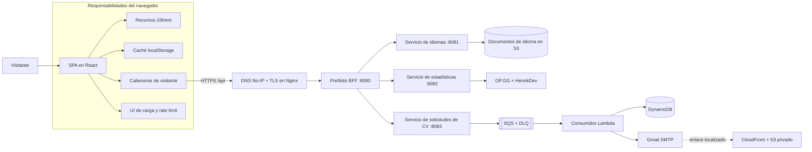

# Portfolio Frontend

[English](README.md) | **Español**

<p align="center">
  
  
  
  
  
</p>

Portafolio responsive de una sola página para **Juan Diego Arévalo Bernal**. Presenta experiencia profesional, proyectos seleccionados, estadísticas de videojuegos en vivo, la arquitectura de producción y un formulario asíncrono de entrega de CV mediante una interfaz editorial y técnica.

La aplicación es el cliente web del [Portfolio Backend (BFF)](https://github.com/JuanSlaterT/portfolio-backend). Su contenido no se incluye como archivos estáticos de traducción: durante el arranque, el frontend descubre los idiomas disponibles y descarga desde la API todos sus documentos de traducción.

> API pública: `https://api.juancito.me/api`, configurada mediante `VITE_API_BASE_URL`.

## Características principales

- Interfaz responsive de estilo técnico-editorial con cuatro vistas: Inicio, Hobbies, Arquitectura y CV.
- Enlaces directos para `/`, `/hobbies`, `/architecture` y `/resume`, sincronizados con los botones atrás/adelante del navegador.
- Internacionalización dirigida por la API, selección automática según el navegador y selector persistente de idioma.
- Estadísticas en vivo de League of Legends y VALORANT con caché de navegador por cinco minutos.
- Documentación interactiva de la arquitectura del BFF, microservicios, recursos AWS y flujos síncronos/asíncronos.
- Formulario de solicitud de CV con validación, entrega localizada, suscripción opcional y protección contra solicitudes duplicadas.
- Metadatos estables por navegador y un hash best-effort de la IPv4 pública incluidos automáticamente en cada petición a la API.
- Indicadores globales de carga, estados de error, reintentos y cuenta regresiva persistente para bloqueos HTTP `429`.
- Pruebas automatizadas unitarias y de componentes para rutas, navegación, identidad del visitante, cachés y persistencia del rate limit.
- Diseños adaptables, foco visible para teclado, landmarks semánticos y navegación móvil reducida.

## Papel dentro del sistema

Este repositorio se encarga de la presentación y la orquestación en el navegador. No llama directamente a servicios internos ni a proveedores externos de videojuegos: todas las operaciones pasan por el BFF público.



Una petición normal del navegador sigue este recorrido:

1. La aplicación crea o restaura los metadatos del visitante y, cuando corresponde, intenta resolver y hashear la IPv4 pública mediante ipify.
2. `src/lib/api.ts` añade las cabeceras y llama al BFF público.
3. Nginx termina TLS y reenvía el tráfico de `/api` al BFF.
4. El BFF valida las cabeceras, aplica su limitador y delega en un microservicio privado.
5. El frontend interpreta el contrato compartido `{ statusCode, message, data }`.
6. Una respuesta `429` activa la pantalla global de bloqueo usando la cabecera `x-missingTime`.

## Páginas

| Vista | Ruta | Propósito |
| --- | --- | --- |
| **Inicio** | `/` | Hero, resumen profesional, matriz de habilidades, repositorios destacados, redes y contacto. |
| **Hobbies** | `/hobbies` | Estadísticas en vivo de League of Legends y VALORANT junto con intereses personales. |
| **Arquitectura** | `/architecture` | Diagrama del sistema, flujos de requests, catálogo de repositorios, módulos de Terraform y decisiones operativas. |
| **CV** | `/resume` | Formulario de correo que inicia el flujo asíncrono de entrega localizada del CV. |

`App.tsx` usa la History API del navegador para inicializar la vista desde el pathname, añadir entradas de navegación y reaccionar a `popstate`. Las opciones de navegación siguen siendo enlaces reales, por lo que las vistas se pueden copiar, abrir en otra pestaña, recargar y recorrer con los controles del navegador sin añadir una dependencia de routing.

## Arquitectura del frontend

El orden de los providers en la raíz es intencional:

```text
StrictMode
└── RateLimitProvider
    └── LoadingProvider
        └── LanguageProvider
            └── App
                ├── NavBar
                ├── Página activa
                └── Footer
```

| Capa | Responsabilidad |
| --- | --- |
| `RateLimitProvider` | Sustituye la aplicación por una cuenta regresiva global mientras el visitante está bloqueado. |
| `LoadingProvider` | Muestra mediante un portal un modal mientras se ejecutan operaciones de API monitoreadas. |
| `LanguageProvider` | Obtiene el catálogo y todos los documentos de traducción antes de renderizar el sitio. |
| `App` | Sincroniza la vista actual con la URL y compone la navegación y el footer compartidos. |
| `portfolioApi` | Añade cabeceras, interpreta el envelope, convierte fallos en `ApiError` y detecta respuestas `429`. |

### Internacionalización

La internacionalización se resuelve en tiempo de ejecución desde la API:

1. La aplicación solicita `GET /api/languages`.
2. Descarga en paralelo cada documento mediante `GET /api/languages/{language}`.
3. Normaliza los documentos y los registra como resource bundles de i18next.
4. Selecciona el idioma inicial según la preferencia guardada, el navegador, el fallback inglés o el primer idioma disponible.
5. Genera el selector con el catálogo recibido y guarda la elección en `portfolio-lang`.

Si el catálogo está vacío, contiene códigos duplicados o no puede cargarse, la aplicación muestra un error localizado de arranque con una acción de reintento. El sitio espera intencionalmente al servicio de idiomas antes de mostrar el contenido.

### Metadatos del visitante

Cada petición a la API que no sea preflight incluye:

| Cabecera | Valor generado en el navegador |
| --- | --- |
| `x-visitorId` | UUID v4 persistente generado en el navegador. |
| `x-ipHash` | Hash best-effort de la IPv4 pública devuelta por ipify: SHA-256 mediante Web Crypto, con un fallback determinista si no está disponible. Si falla la consulta de IPv4, se hashea el UUID del visitante. |
| `x-userAgent` | Valor actual de `navigator.userAgent`. |
| `x-lastSeenAt` | Timestamp Unix actual en milisegundos. |

Inmediatamente antes de cada petición a la API del portafolio, el cliente consulta `https://api.ipify.org?format=json` con la caché deshabilitada, acepta únicamente IPv4 y deja de esperar después de 2,5 segundos. La dirección obtenida se hashea en memoria para esa petición y nunca se persiste ni se envía sin procesar a la API del portafolio. En `visitor-portfolio` solo se guarda el UUID estable del visitante; si `localStorage` no está disponible, la aplicación mantiene esa identidad en memoria durante la sesión actual.

La solicitud de CV reutiliza el mismo hash recién generado tanto en la cabecera `x-ipHash` como en el body JSON. Esto no es una frontera de confianza: `x-ipHash` continúa siendo un dato suministrado por el cliente y un navegador o cliente HTTP modificado puede reemplazarlo.

### Persistencia en el navegador

| Clave | Propósito | Duración |
| --- | --- | --- |
| `portfolio-lang` | Código del idioma seleccionado. | Hasta eliminarla manualmente. |
| `visitor-portfolio` | Solo el UUID estable del visitante; no se almacena la IPv4 ni su hash. | Hasta eliminarla manualmente. |
| `portfolio:my-hobbies:stats:v1` | Última respuesta exitosa de estadísticas. | Cinco minutos. |
| `portfolio:cv-request:v1` | Evita repetir inmediatamente una solicitud de CV. | Diez minutos. |
| `portfolio:rate-limit-until` | Restaura entre recargas y pestañas el límite indicado por el servidor. | Hasta que expire el bloqueo. |

Las estadísticas, el estado de solicitud de CV y los límites persistidos se validan por esquema y tiempo antes de usarse; los datos inválidos o expirados se descartan. El almacenamiento del navegador sigue bajo control del visitante, así que estos valores son controles de conveniencia y no estado de seguridad confiable.

## Integración con el backend

Vite inyecta la URL base mediante la variable de entorno obligatoria `VITE_API_BASE_URL`. El ejemplo predeterminado de producción se encuentra en [`.env.example`](.env.example):

```dotenv
VITE_API_BASE_URL=https://api.juancito.me/api
```

[`src/lib/api.ts`](src/lib/api.ts) valida que el valor exista, sea una URL HTTPS absoluta y no termine en `/`. Las rutas de los endpoints empiezan con una única barra, de modo que el valor de producción genera direcciones como `https://api.juancito.me/api/languages` sin `//` ni un segmento `/api` duplicado.

Todas las variables `VITE_*` se incorporan al bundle del cliente y son visibles para cualquier visitante. `VITE_API_BASE_URL` es configuración pública y debe almacenarse como Variable de GitHub Actions, nunca como secreto.

| Método | Endpoint | Uso en el frontend |
| --- | --- | --- |
| `GET` | `/languages` | Carga el catálogo de idiomas. |
| `GET` | `/languages/{language}` | Carga un documento de traducción. |
| `GET` | `/stats` | Carga la vista combinada de League of Legends y VALORANT. |
| `POST` | `/resume-request` | Inicia la entrega asíncrona del CV. |

Las respuestas exitosas deben usar el envelope del BFF:

```json
{
  "statusCode": 200,
  "message": "OK",
  "data": {}
}
```

Body de una solicitud de CV:

```json
{
  "email": "persona@example.com",
  "ipHash": "hash-generado-en-el-cliente",
  "language": "es",
  "subscribeToUpdates": true
}
```

El formulario envía actualmente solo `en` o `es`, ya que el consumidor downstream mantiene plantillas y documentos de CV para esos idiomas.

## Stack tecnológico

| Área | Tecnología |
| --- | --- |
| UI | React 18, React DOM |
| Lenguaje | TypeScript 5.5 |
| Build | Vite 7.3 |
| Estilos | Tailwind CSS 3.4, PostCSS y variables CSS propias |
| Internacionalización | i18next, react-i18next |
| Iconos | Lucide React |
| Pruebas y calidad | Vitest, Testing Library, jest-dom, jsdom, ESLint 9, compilador de TypeScript |
| APIs del navegador | Fetch, History, Web Crypto, Local Storage, Intl |

## Sistema de diseño

La interfaz combina brutalismo editorial con una estética de cuaderno de sistemas:

- superficies de papel (`#F1EEE5`, `#E5E0D4` y `#F8F5EC`);
- tinta cálida (`#171713`) para la estructura y la tipografía;
- naranja de señal (`#FF4D00`), verde ácido (`#D9FF43`) y azul blueprint (`#2457FF`);
- componentes cuadrados, bordes de uno o dos píxeles, sombras sólidas desplazadas, retículas técnicas, tipografía display condensada y metadatos monoespaciados;
- transiciones cortas de color y posición en lugar de movimiento decorativo.

Los primitivos visuales reutilizables `.ink-button`, `.outline-button`, `.technical-tag`, `.paper-grid` y `.display-type` se encuentran en `src/index.css`.

## Desarrollo local

### Requisitos

- Node.js 20.19+ o 22.12+;
- npm;
- acceso de red al BFF público o un BFF compatible configurado mediante `VITE_API_BASE_URL`;
- acceso opcional a `api.ipify.org` para hashear la IPv4 pública. El fallback basado en UUID mantiene el sitio operativo si no está disponible.

`VITE_API_BASE_URL` es obligatoria. Copia `.env.example` al archivo local `.env`, ignorado por Git, o define la variable en el entorno de compilación. Debe usar HTTPS y no puede terminar en una barra. Vite incorpora el valor durante el build, por lo que cambiar una variable del host después del despliegue no modifica un bundle estático existente.

### Instalación y ejecución

```bash
git clone https://github.com/JuanSlaterT/portfolio-frontend.git
cd portfolio-frontend
npm install
cp .env.example .env
npm run dev
```

Abre `http://localhost:5173`.

El BFF de producción permite actualmente este origen mediante CORS. Si el frontend se ejecuta desde otro origen, se debe modificar `CorsConfig` en el backend.

### Scripts disponibles

| Comando | Acción |
| --- | --- |
| `npm run dev` | Inicia el servidor de desarrollo de Vite. |
| `npm run build` | Genera el bundle de producción en `dist/`. |
| `npm test` | Ejecuta una vez la suite automatizada con Vitest. |
| `npm run test:watch` | Ejecuta Vitest en modo watch. |
| `npm run typecheck` | Ejecuta TypeScript sin generar archivos. |
| `npm run lint` | Ejecuta ESLint sobre el proyecto. |
| `npm run preview` | Sirve localmente el bundle compilado. |

### Pruebas automatizadas

La suite se ejecuta con jsdom y cubre:

- asociación entre rutas y páginas, enlaces directos, History API y canonicalización de rutas desconocidas;
- valores `href` reales y navegación client-side mediante clics;
- configuración obligatoria del entorno de API y construcción exacta de endpoints;
- validación de IPv4, hashing, migración de visitantes antiguos y fallback sin conexión;
- validación del esquema de la caché de estadísticas, rechazo de manipulaciones y expiración TTL;
- persistencia y vencimiento del rate limit.

## Build de producción

```bash
npm ci
npm run typecheck
npm test
npm run build
npm run preview
```

Asegúrate de definir `VITE_API_BASE_URL` antes de ejecutar `npm run build`; el ejemplo de producción apunta a `https://api.juancito.me/api`.

`dist/` es un bundle estático y puede desplegarse en un object store/CDN como Amazon S3 y CloudFront. El alojamiento del frontend es independiente de los despliegues del BFF y los microservicios.

El host de producción debe servir `index.html` para `/hobbies`, `/architecture`, `/resume` y las rutas desconocidas de la aplicación. En S3/CloudFront se debe configurar el fallback de SPA en la distribución/respuesta de error o capa de rewrite; de lo contrario, una petición directa a una ruta interna puede devolver un `404` del object store antes de que React se inicie.

### Despliegue automático de producción

[`.github/workflows/deploy.yml`](.github/workflows/deploy.yml) despliega automáticamente después de cada push a `main` y también puede iniciarse manualmente. El job está protegido para ejecutarse exclusivamente desde `refs/heads/main`, declara el GitHub Environment `production` y usa concurrencia de producción con cancelación del despliegue anterior.

El workflow ejecuta `npm ci`, el typecheck, el lint y el build de producción antes de solicitar credenciales AWS. Después utiliza GitHub OIDC para asumir el rol IAM administrado por Terraform mediante credenciales STS temporales. No utiliza access keys, secret keys, tokens de larga duración, comandos Terraform ni ACL públicas de S3.

Configura los siguientes nombres como Variables de GitHub Actions a nivel del repositorio o del environment `production`, nunca como Secrets:

| Variable | Propósito |
| --- | --- |
| `AWS_ACCOUNT_ID` | Cuenta AWS esperada; se verifica al configurar las credenciales. |
| `AWS_REGION` | Región utilizada por AWS CLI y la sesión STS. |
| `AWS_ROLE_ARN` | Rol IAM administrado por Terraform y confiable mediante GitHub OIDC. |
| `FRONTEND_BUCKET_NAME` | Bucket S3 privado que recibe `dist/`. |
| `CLOUDFRONT_DISTRIBUTION_ID` | Distribución invalidada después de una carga exitosa. |
| `VITE_API_BASE_URL` | URL base pública incorporada al bundle. Valor de producción: `https://api.juancito.me/api`. |

Obtén el contrato de despliegue después de aplicar el repositorio de infraestructura:

```bash
terraform output -json frontend_deployment_contract
```

El workflow publica primero los archivos con hash de `dist/assets/` y les asigna una caché inmutable de un año. Después publica el resto de `dist/` con `no-cache,no-store,must-revalidate` y solo entonces elimina los assets con hash obsoletos. Las rutas `/` y `/index.html` de CloudFront se invalidan únicamente si todas las sincronizaciones terminan correctamente. El bucket S3 permanece privado y los visitantes acceden a los objetos exclusivamente mediante el Origin Access Control de CloudFront administrado por Terraform.

El BFF debe permitir el origen de producción `https://juancito.me` en su configuración CORS. Este es un prerrequisito externo del despliegue; el repositorio frontend no modifica el backend ni la infraestructura AWS.

## Estructura del repositorio

```text
.
├── .github/
│   └── workflows/deploy.yml     # Despliegue OIDC a S3/CloudFront
├── public/
│   └── favicon.svg
├── src/
│   ├── components/
│   │   ├── layout/              # Encabezados de páginas y secciones
│   │   ├── LanguageProvider.tsx # Arranque de traducciones en runtime
│   │   ├── LanguageSwitcher.tsx
│   │   ├── LoadingProvider.tsx
│   │   ├── LoadingModal.tsx
│   │   ├── NavBar.tsx
│   │   └── RateLimitProvider.tsx
│   ├── contexts/                # Contextos de carga e idiomas
│   ├── hooks/                   # Hooks para consumir los contextos
│   ├── i18n/                    # Inicialización de i18next y preferencia
│   ├── lib/
│   │   ├── api.ts               # Contrato y cliente del BFF
│   │   ├── rateLimit.ts
│   │   ├── routes.ts            # Asociación entre URL y página
│   │   ├── statsCache.ts        # Caché validada de estadísticas
│   │   └── visitor.ts
│   ├── pages/                   # Inicio, Hobbies, Arquitectura y CV
│   ├── test/                    # Configuración de Vitest/Testing Library
│   ├── App.tsx
│   ├── index.css
│   └── main.tsx
├── .env.example
├── index.html
├── package.json
├── tailwind.config.js
├── tsconfig*.json
└── vite.config.ts
```

## Repositorios relacionados

| Repositorio | Responsabilidad |
| --- | --- |
| [`portfolio-backend`](https://github.com/JuanSlaterT/portfolio-backend) | BFF público en Java, validación de visitantes, envelope de respuestas, CORS y rate limiting. |
| [`portfolio-microservices-language_service`](https://github.com/JuanSlaterT/portfolio-microservices-language_service) | Catálogo y documentos de traducción almacenados en S3. |
| [`portfolio-microservices-stats_service`](https://github.com/JuanSlaterT/portfolio-microservices-stats_service) | Estadísticas agregadas desde OP.GG y HenrikDev. |
| [`portfolio-microservices-resume_request_service`](https://github.com/JuanSlaterT/portfolio-microservices-resume_request_service) | Valida solicitudes de CV y las publica en SQS. |
| [`portfolio-consumer-resume_request`](https://github.com/JuanSlaterT/portfolio-consumer-resume_request) | Consumidor Lambda para persistencia, notificaciones, correo localizado y reporte de fallos parciales de lotes SQS. |
| [`portfolio-arch-terraform`](https://github.com/JuanSlaterT/portfolio-arch-terraform) | Infraestructura AWS, redes, stack de ejecución, observabilidad y despliegues. |

## Consideraciones actuales

- La API de idiomas es una dependencia de arranque: sin ella, la aplicación principal no se renderiza.
- La URL pública de la API está escrita directamente en el código en vez de seleccionarse mediante una variable de entorno de Vite.
- Los enlaces directos requieren que el host/CDN estático redirija las rutas de la aplicación hacia `index.html`.
- Los metadatos de visitante y el rate limiting son controles contra abuso, no autenticación ni autorización.
- La consulta de IPv4 pública es best-effort y añade una petición a ipify. El hash continúa siendo client-side, puede representar una dirección NAT compartida y no debe usarse como identidad verificada; si la consulta falla se usa el hash del UUID.
- La disponibilidad de estadísticas depende de los dos proveedores externos usados por el servicio.
- La aceptación del CV confirma la publicación en la cola. La Lambda reporta fallos parciales para que SQS reintente solo los registros fallidos; después de los intentos de redrive configurados, los mensajes sin resolver permanecen en la DLQ para investigación, replay o envío manual del correo.
- El visitante puede modificar el almacenamiento del navegador. La aplicación valida su estructura y expiración y rechaza los valores inválidos, pero ni `Object.freeze()` ni el código frontend pueden crear almacenamiento client-side a prueba de manipulaciones.
- La suite automatizada cubre unidades y componentes en jsdom; aún no hay pruebas end-to-end en un navegador real ni regresión visual.

## Autor

**Juan Diego Arévalo Bernal**  
[GitHub](https://github.com/JuanSlaterT) · [LinkedIn](https://www.linkedin.com/in/juan-diego-ar%C3%A9valo-bernal-219428227/)
