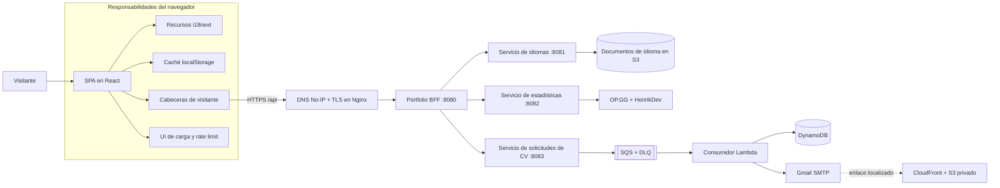

# Portfolio Frontend

[English](README.md) | **Español**

<p align="center">
  
  
  
  
  
</p>

Portafolio responsive de una sola página para **Juan Diego Arévalo Bernal**. Presenta experiencia profesional, proyectos seleccionados, estadísticas de videojuegos en vivo, la arquitectura de producción y un formulario asíncrono de entrega de CV mediante una interfaz editorial y técnica.

La aplicación es el cliente web del [Portfolio Backend (BFF)](https://github.com/JuanSlaterT/portfolio-backend). Su contenido no se incluye como archivos estáticos de traducción: durante el arranque, el frontend descubre los idiomas disponibles y descarga desde la API todos sus documentos de traducción.

> API pública: `https://api-portfolio.zapto.org/api`

## Características principales

- Interfaz responsive de estilo técnico-editorial con cuatro vistas: Inicio, Hobbies, Arquitectura y CV.
- Internacionalización dirigida por la API, selección automática según el navegador y selector persistente de idioma.
- Estadísticas en vivo de League of Legends y VALORANT con caché de navegador por cinco minutos.
- Documentación interactiva de la arquitectura del BFF, microservicios, recursos AWS y flujos síncronos/asíncronos.
- Formulario de solicitud de CV con validación, entrega localizada, suscripción opcional y protección contra solicitudes duplicadas.
- Metadatos estables por navegador incluidos automáticamente en cada petición a la API.
- Indicadores globales de carga, estados de error, reintentos y cuenta regresiva persistente para bloqueos HTTP `429`.
- Diseños adaptables, foco visible para teclado, landmarks semánticos y navegación móvil reducida.

## Papel dentro del sistema

Este repositorio se encarga de la presentación y la orquestación en el navegador. No llama directamente a servicios internos ni a proveedores externos de videojuegos: todas las operaciones pasan por el BFF público.



Una petición normal del navegador sigue este recorrido:

1. La aplicación crea o restaura los metadatos de visitante guardados por el navegador.
2. `src/lib/api.ts` añade las cabeceras y llama al BFF público.
3. Nginx termina TLS y reenvía el tráfico de `/api` al BFF.
4. El BFF valida las cabeceras, aplica su limitador y delega en un microservicio privado.
5. El frontend interpreta el contrato compartido `{ statusCode, message, data }`.
6. Una respuesta `429` activa la pantalla global de bloqueo usando la cabecera `x-missingTime`.

## Páginas

| Vista | Propósito |
| --- | --- |
| **Inicio** | Hero, resumen profesional, matriz de habilidades, repositorios destacados, redes y contacto. |
| **Hobbies** | Estadísticas en vivo de League of Legends y VALORANT junto con intereses personales. |
| **Arquitectura** | Diagrama del sistema, flujos de requests, catálogo de repositorios, módulos de Terraform y decisiones operativas. |
| **CV** | Formulario de correo que inicia el flujo asíncrono de entrega localizada del CV. |

La navegación se controla mediante estado en `App.tsx`; actualmente el proyecto no usa un router basado en URL. Por ello, al recargar se regresa a la vista Inicio.

## Arquitectura del frontend

El orden de los providers en la raíz es intencional:

```text
StrictMode
└── RateLimitProvider
    └── LoadingProvider
        └── LanguageProvider
            └── App
                ├── NavBar
                ├── Página activa
                └── Footer
```

| Capa | Responsabilidad |
| --- | --- |
| `RateLimitProvider` | Sustituye la aplicación por una cuenta regresiva global mientras el visitante está bloqueado. |
| `LoadingProvider` | Muestra mediante un portal un modal mientras se ejecutan operaciones de API monitoreadas. |
| `LanguageProvider` | Obtiene el catálogo y todos los documentos de traducción antes de renderizar el sitio. |
| `App` | Mantiene la vista actual y compone la navegación y el footer compartidos. |
| `portfolioApi` | Añade cabeceras, interpreta el envelope, convierte fallos en `ApiError` y detecta respuestas `429`. |

### Internacionalización

La internacionalización se resuelve en tiempo de ejecución desde la API:

1. La aplicación solicita `GET /api/languages`.
2. Descarga en paralelo cada documento mediante `GET /api/languages/{language}`.
3. Normaliza los documentos y los registra como resource bundles de i18next.
4. Selecciona el idioma inicial según la preferencia guardada, el navegador, el fallback inglés o el primer idioma disponible.
5. Genera el selector con el catálogo recibido y guarda la elección en `portfolio-lang`.

Si el catálogo está vacío, contiene códigos duplicados o no puede cargarse, la aplicación muestra un error localizado de arranque con una acción de reintento. El sitio espera intencionalmente al servicio de idiomas antes de mostrar el contenido.

### Metadatos del visitante

Cada petición a la API que no sea preflight incluye:

| Cabecera | Valor generado en el navegador |
| --- | --- |
| `x-visitorId` | UUID v4 persistente generado en el navegador. |
| `x-ipHash` | SHA-256 del UUID del visitante o un fallback determinista no criptográfico cuando Web Crypto no está disponible. No se obtiene desde la IP de red del visitante. |
| `x-userAgent` | Valor actual de `navigator.userAgent`. |
| `x-lastSeenAt` | Timestamp Unix actual en milisegundos. |

El registro se guarda bajo `visitor-portfolio`. Si `localStorage` no está disponible, la aplicación mantiene una identidad estable en memoria durante la sesión actual.

### Persistencia en el navegador

| Clave | Propósito | Duración |
| --- | --- | --- |
| `portfolio-lang` | Código del idioma seleccionado. | Hasta eliminarla manualmente. |
| `visitor-portfolio` | UUID, hash del cliente, user agent y última actividad. | Hasta eliminarla manualmente. |
| `portfolio:my-hobbies:stats:v1` | Última respuesta exitosa de estadísticas. | Cinco minutos. |
| `portfolio:cv-request:v1` | Evita repetir inmediatamente una solicitud de CV. | Diez minutos. |
| `portfolio:rate-limit-until` | Restaura entre recargas y pestañas el límite indicado por el servidor. | Hasta que expire el bloqueo. |

## Integración con el backend

La URL base se declara actualmente de forma directa en [`src/lib/api.ts`](src/lib/api.ts):

```ts
export const API_BASE_URL = 'https://api-portfolio.zapto.org/api';
```

| Método | Endpoint | Uso en el frontend |
| --- | --- | --- |
| `GET` | `/languages` | Carga el catálogo de idiomas. |
| `GET` | `/languages/{language}` | Carga un documento de traducción. |
| `GET` | `/stats` | Carga la vista combinada de League of Legends y VALORANT. |
| `POST` | `/resume-request` | Inicia la entrega asíncrona del CV. |

Las respuestas exitosas deben usar el envelope del BFF:

```json
{
  "statusCode": 200,
  "message": "OK",
  "data": {}
}
```

Body de una solicitud de CV:

```json
{
  "email": "persona@example.com",
  "ipHash": "hash-generado-en-el-cliente",
  "language": "es",
  "subscribeToUpdates": true
}
```

El formulario envía actualmente solo `en` o `es`, ya que el consumidor downstream mantiene plantillas y documentos de CV para esos idiomas.

## Stack tecnológico

| Área | Tecnología |
| --- | --- |
| UI | React 18, React DOM |
| Lenguaje | TypeScript 5.5 |
| Build | Vite 5.4 |
| Estilos | Tailwind CSS 3.4, PostCSS y variables CSS propias |
| Internacionalización | i18next, react-i18next |
| Iconos | Lucide React |
| Calidad | ESLint 9, compilador de TypeScript |
| APIs del navegador | Fetch, Web Crypto, Local Storage, Intl |

## Sistema de diseño

La interfaz combina brutalismo editorial con una estética de cuaderno de sistemas:

- superficies de papel (`#F1EEE5`, `#E5E0D4` y `#F8F5EC`);
- tinta cálida (`#171713`) para la estructura y la tipografía;
- naranja de señal (`#FF4D00`), verde ácido (`#D9FF43`) y azul blueprint (`#2457FF`);
- componentes cuadrados, bordes de uno o dos píxeles, sombras sólidas desplazadas, retículas técnicas, tipografía display condensada y metadatos monoespaciados;
- transiciones cortas de color y posición en lugar de movimiento decorativo.

Los primitivos visuales reutilizables `.ink-button`, `.outline-button`, `.technical-tag`, `.paper-grid` y `.display-type` se encuentran en `src/index.css`.

## Desarrollo local

### Requisitos

- Node.js 18 o superior;
- npm;
- acceso de red al BFF público o un BFF compatible configurado en `src/lib/api.ts`.

Actualmente el repositorio no requiere variables de entorno para el frontend. El archivo `.env` existente está vacío y Git lo ignora.

### Instalación y ejecución

```bash
git clone https://github.com/JuanSlaterT/portfolio-frontend.git
cd portfolio-frontend
npm install
npm run dev
```

Abre `http://localhost:5173`.

El BFF de producción permite actualmente este origen mediante CORS. Si el frontend se ejecuta desde otro origen, se debe modificar `CorsConfig` en el backend.

### Scripts disponibles

| Comando | Acción |
| --- | --- |
| `npm run dev` | Inicia el servidor de desarrollo de Vite. |
| `npm run build` | Genera el bundle de producción en `dist/`. |
| `npm run typecheck` | Ejecuta TypeScript sin generar archivos. |
| `npm run lint` | Ejecuta ESLint sobre el proyecto. |
| `npm run preview` | Sirve localmente el bundle compilado. |

Actualmente no hay una suite automatizada de pruebas de frontend.

## Build de producción

```bash
npm ci
npm run typecheck
npm run build
npm run preview
```

`dist/` es un bundle estático y puede desplegarse en un object store/CDN como Amazon S3 y CloudFront. El alojamiento del frontend es independiente de los despliegues del BFF y los microservicios.

Como la selección de vistas se basa en estado y no se utiliza un router, el build actual no requiere reglas del servidor para redirigir rutas anidadas hacia la SPA.

## Estructura del repositorio

```text
.
├── public/
│   └── favicon.svg
├── src/
│   ├── components/
│   │   ├── layout/              # Encabezados de páginas y secciones
│   │   ├── LanguageProvider.tsx # Arranque de traducciones en runtime
│   │   ├── LanguageSwitcher.tsx
│   │   ├── LoadingProvider.tsx
│   │   ├── LoadingModal.tsx
│   │   ├── NavBar.tsx
│   │   └── RateLimitProvider.tsx
│   ├── contexts/                # Contextos de carga e idiomas
│   ├── hooks/                   # Hooks para consumir los contextos
│   ├── i18n/                    # Inicialización de i18next y preferencia
│   ├── lib/
│   │   ├── api.ts               # Contrato y cliente del BFF
│   │   ├── clientHash.ts
│   │   ├── rateLimit.ts
│   │   └── visitor.ts
│   ├── pages/                   # Inicio, Hobbies, Arquitectura y CV
│   ├── App.tsx
│   ├── index.css
│   └── main.tsx
├── index.html
├── package.json
├── tailwind.config.js
├── tsconfig*.json
└── vite.config.ts
```

## Repositorios relacionados

| Repositorio | Responsabilidad |
| --- | --- |
| [`portfolio-backend`](https://github.com/JuanSlaterT/portfolio-backend) | BFF público en Java, validación de visitantes, envelope de respuestas, CORS y rate limiting. |
| [`portfolio-microservices-language_service`](https://github.com/JuanSlaterT/portfolio-microservices-language_service) | Catálogo y documentos de traducción almacenados en S3. |
| [`portfolio-microservices-stats_service`](https://github.com/JuanSlaterT/portfolio-microservices-stats_service) | Estadísticas agregadas desde OP.GG y HenrikDev. |
| [`portfolio-microservices-resume_request_service`](https://github.com/JuanSlaterT/portfolio-microservices-resume_request_service) | Valida solicitudes de CV y las publica en SQS. |
| [`portfolio-consumer-resume_request`](https://github.com/JuanSlaterT/portfolio-consumer-resume_request) | Consumidor Lambda para persistencia, notificaciones y entrega localizada por correo. |
| [`portfolio-arch-terraform`](https://github.com/JuanSlaterT/portfolio-arch-terraform) | Infraestructura AWS, redes, stack de ejecución, observabilidad y despliegues. |

## Consideraciones actuales

- La API de idiomas es una dependencia de arranque: sin ella, la aplicación principal no se renderiza.
- La URL pública de la API está escrita directamente en el código en vez de seleccionarse mediante una variable de entorno de Vite.
- El estado de navegación no se codifica en la URL, por lo que las vistas no admiten deep links.
- Los metadatos de visitante y el rate limiting son controles contra abuso, no autenticación ni autorización.
- El `x-ipHash` generado en el navegador deriva del UUID del visitante y no debe tratarse como un hash verificado de su dirección de red.
- La disponibilidad de estadísticas depende de los dos proveedores externos usados por el servicio.
- La aceptación de una solicitud de CV confirma que el flujo asíncrono comenzó; no garantiza que la persistencia y el correo ya hayan finalizado.
- Las cachés del navegador son controles de conveniencia y el visitante puede borrarlas o modificarlas.
- No existen pruebas automatizadas de frontend configuradas actualmente.

## Autor

**Juan Diego Arévalo Bernal**  
[GitHub](https://github.com/JuanSlaterT) · [LinkedIn](https://www.linkedin.com/in/juan-diego-ar%C3%A9valo-bernal-219428227/)
