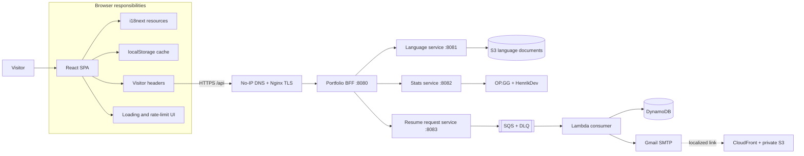

# Portfolio Frontend

**English** | [Español](README.es.md)

<p align="center">
  
  
  
  
  
</p>

Responsive single-page portfolio for **Juan Diego Arévalo Bernal**. It presents professional experience, selected projects, live gaming statistics, the production architecture, and an asynchronous resume-delivery form through a technical editorial interface.

The application is the browser-facing client of the [Portfolio Backend (BFF)](https://github.com/JuanSlaterT/portfolio-backend). Its content is not bundled as static translation files: the frontend discovers the available languages and downloads every translation document from the API during startup.

> Public API: `https://api-portfolio.zapto.org/api`

## Highlights

- Responsive technical-editorial interface with four views: Home, Hobbies, Architecture, and Resume.
- API-driven internationalization with automatic browser-language selection and a persistent language switcher.
- Live League of Legends and VALORANT statistics with a five-minute browser cache.
- Interactive architecture documentation for the BFF, microservices, AWS resources, and synchronous/asynchronous request paths.
- Resume request form with validation, localized delivery, optional update subscription, and duplicate-request protection.
- Stable per-browser visitor metadata attached to every API request.
- Global loading feedback, API error states, retry actions, and a persistent countdown for HTTP `429` blocks.
- Responsive layouts, keyboard focus indicators, semantic landmarks, and reduced mobile navigation.

## Role in the system

This repository owns presentation and browser-side orchestration. It does not call internal services or third-party gaming providers directly. Every operation goes through the public BFF.



A typical browser request follows this path:

1. The app creates or restores the visitor metadata stored by the browser.
2. `src/lib/api.ts` adds the visitor headers and calls the public BFF.
3. Nginx terminates TLS and forwards `/api` traffic to the BFF.
4. The BFF validates the headers, applies its request limiter, and delegates to a private microservice.
5. The frontend reads the shared `{ statusCode, message, data }` response envelope.
6. A `429` response activates the global block screen using the `x-missingTime` response header.

## Pages

| View | Purpose |
| --- | --- |
| **Home** | Hero, profile summary, technical skill matrix, selected repositories, social links, and contact information. |
| **Hobbies** | Live League of Legends and VALORANT statistics plus a grid of personal interests. |
| **Architecture** | System diagram, request flows, repository catalog, Terraform modules, and operational decisions. |
| **Resume** | Email form that starts the asynchronous localized resume-delivery workflow. |

Navigation is controlled by application state in `App.tsx`; the project currently does not use a URL router. Refreshing the page therefore returns to the Home view.

## Frontend architecture

The root provider order is intentional:

```text
StrictMode
└── RateLimitProvider
    └── LoadingProvider
        └── LanguageProvider
            └── App
                ├── NavBar
                ├── Active page
                └── Footer
```

| Layer | Responsibility |
| --- | --- |
| `RateLimitProvider` | Replaces the application with a global countdown while the visitor is blocked. |
| `LoadingProvider` | Displays a portal-based modal while tracked API operations are running. |
| `LanguageProvider` | Fetches the language catalog and all translation documents before rendering the site. |
| `App` | Owns the current view and composes the shared navigation and footer. |
| `portfolioApi` | Adds headers, parses the API envelope, translates failed responses into `ApiError`, and detects `429`. |

### Internationalization

Internationalization is runtime and API-driven:

1. The app requests `GET /api/languages`.
2. It downloads each document with `GET /api/languages/{language}` in parallel.
3. Documents are normalized and registered as i18next resource bundles.
4. The initial language is chosen from the saved preference, browser locale, English fallback, or first available language.
5. The selector is generated from the returned catalog and stores the selection under `portfolio-lang`.

If the catalog is empty, contains duplicate codes, or cannot be loaded, the application shows a localized bootstrap error with a retry action. The site intentionally waits for the language service before rendering content.

### Visitor metadata

Every non-preflight API request includes:

| Header | Browser value |
| --- | --- |
| `x-visitorId` | Persistent UUID v4 generated in the browser. |
| `x-ipHash` | SHA-256 of the visitor UUID, or a deterministic non-cryptographic fallback when Web Crypto is unavailable. It is not obtained from the visitor's network IP. |
| `x-userAgent` | Current `navigator.userAgent`. |
| `x-lastSeenAt` | Current Unix timestamp in milliseconds. |

The visitor record is stored under `visitor-portfolio`. If `localStorage` is unavailable, the app keeps a stable identity in memory for the current session.

### Browser persistence

| Key | Purpose | Lifetime |
| --- | --- | --- |
| `portfolio-lang` | Selected language code. | Until manually cleared. |
| `visitor-portfolio` | UUID, client hash, user agent, and last-seen timestamp. | Until manually cleared. |
| `portfolio:my-hobbies:stats:v1` | Last successful gaming-statistics response. | Five minutes. |
| `portfolio:cv-request:v1` | Prevents an immediate duplicate resume request. | Ten minutes. |
| `portfolio:rate-limit-until` | Restores the server-provided block deadline across refreshes and tabs. | Until the deadline expires. |

## Backend integration

The API base URL is currently declared directly in [`src/lib/api.ts`](src/lib/api.ts):

```ts
export const API_BASE_URL = 'https://api-portfolio.zapto.org/api';
```

| Method | Endpoint | Frontend use |
| --- | --- | --- |
| `GET` | `/languages` | Loads the language catalog. |
| `GET` | `/languages/{language}` | Loads one translation document. |
| `GET` | `/stats` | Loads the combined League of Legends and VALORANT view. |
| `POST` | `/resume-request` | Starts asynchronous resume delivery. |

Successful responses must use the BFF envelope:

```json
{
  "statusCode": 200,
  "message": "OK",
  "data": {}
}
```

Resume request body:

```json
{
  "email": "person@example.com",
  "ipHash": "client-generated-hash",
  "language": "en",
  "subscribeToUpdates": true
}
```

Only `en` and `es` are currently sent by the resume form because the downstream consumer owns templates and resume documents for those languages.

## Technology stack

| Area | Technology |
| --- | --- |
| UI | React 18, React DOM |
| Language | TypeScript 5.5 |
| Build tooling | Vite 5.4 |
| Styling | Tailwind CSS 3.4, PostCSS, custom CSS variables |
| Internationalization | i18next, react-i18next |
| Icons | Lucide React |
| Quality | ESLint 9, TypeScript compiler |
| Browser APIs | Fetch, Web Crypto, Local Storage, Intl |

## Design system

The interface combines editorial brutalism with a systems-notebook aesthetic:

- paper surfaces (`#F1EEE5`, `#E5E0D4`, and `#F8F5EC`);
- warm ink (`#171713`) for structure and typography;
- signal orange (`#FF4D00`), acid green (`#D9FF43`), and blueprint blue (`#2457FF`);
- square components, one- or two-pixel borders, hard offset shadows, technical grids, condensed display type, and monospaced metadata;
- short color and transform transitions instead of decorative motion.

Reusable visual primitives such as `.ink-button`, `.outline-button`, `.technical-tag`, `.paper-grid`, and `.display-type` live in `src/index.css`.

## Local development

### Requirements

- Node.js 18 or newer;
- npm;
- network access to the public BFF, or a compatible BFF configured in `src/lib/api.ts`.

The repository does not currently require frontend environment variables. The checked-in `.env` is empty and ignored by Git.

### Install and run

```bash
git clone https://github.com/JuanSlaterT/portfolio-frontend.git
cd portfolio-frontend
npm install
npm run dev
```

Open `http://localhost:5173`.

The production BFF currently allows this origin through CORS. If the frontend runs on another origin, update the backend `CorsConfig` accordingly.

### Available scripts

| Command | Action |
| --- | --- |
| `npm run dev` | Starts the Vite development server. |
| `npm run build` | Creates the production bundle in `dist/`. |
| `npm run typecheck` | Runs TypeScript without emitting files. |
| `npm run lint` | Runs ESLint across the project. |
| `npm run preview` | Serves the built bundle locally. |

There is currently no automated frontend test suite configured.

## Production build

```bash
npm ci
npm run typecheck
npm run build
npm run preview
```

`dist/` is a static SPA bundle and can be deployed to an object store/CDN such as Amazon S3 and CloudFront. The frontend hosting workflow is separate from the BFF and microservice deployments.

Because view selection is state-based and no URL router is used, the current build does not require server-side SPA rewrite rules for nested routes.

## Repository structure

```text
.
├── public/
│   └── favicon.svg
├── src/
│   ├── components/
│   │   ├── layout/              # Page and section headings
│   │   ├── LanguageProvider.tsx # Runtime translation bootstrap
│   │   ├── LanguageSwitcher.tsx
│   │   ├── LoadingProvider.tsx
│   │   ├── LoadingModal.tsx
│   │   ├── NavBar.tsx
│   │   └── RateLimitProvider.tsx
│   ├── contexts/                # Loading and language contexts
│   ├── hooks/                   # Context-facing hooks
│   ├── i18n/                    # i18next initialization and preference storage
│   ├── lib/
│   │   ├── api.ts               # BFF contract and request client
│   │   ├── clientHash.ts
│   │   ├── rateLimit.ts
│   │   └── visitor.ts
│   ├── pages/                   # Home, Hobbies, Architecture, and Resume
│   ├── App.tsx
│   ├── index.css
│   └── main.tsx
├── index.html
├── package.json
├── tailwind.config.js
├── tsconfig*.json
└── vite.config.ts
```

## Related repositories

| Repository | Responsibility |
| --- | --- |
| [`portfolio-backend`](https://github.com/JuanSlaterT/portfolio-backend) | Public Java BFF, visitor validation, response envelope, CORS, and rate limiting. |
| [`portfolio-microservices-language_service`](https://github.com/JuanSlaterT/portfolio-microservices-language_service) | Translation catalog and documents stored in S3. |
| [`portfolio-microservices-stats_service`](https://github.com/JuanSlaterT/portfolio-microservices-stats_service) | Aggregated OP.GG and HenrikDev gaming statistics. |
| [`portfolio-microservices-resume_request_service`](https://github.com/JuanSlaterT/portfolio-microservices-resume_request_service) | Validates resume requests and publishes them to SQS. |
| [`portfolio-consumer-resume_request`](https://github.com/JuanSlaterT/portfolio-consumer-resume_request) | Lambda consumer for persistence, notifications, and localized email delivery. |
| [`portfolio-arch-terraform`](https://github.com/JuanSlaterT/portfolio-arch-terraform) | AWS infrastructure, networking, runtime stack, observability, and deployments. |

## Current considerations

- The language API is a startup dependency; without it, the main application does not render.
- The public API URL is hard-coded rather than selected through a Vite environment variable.
- Navigation state is not encoded in the URL, so views cannot currently be deep-linked.
- Visitor metadata and rate limiting are abuse controls, not authentication or authorization.
- The browser-generated `x-ipHash` is derived from the visitor UUID and must not be treated as a verified network-address hash.
- Statistics availability depends on both external providers used by the stats service.
- Resume acceptance confirms the asynchronous request was submitted; it does not guarantee that persistence and email delivery have already completed.
- Browser caches are convenience controls and can be cleared or modified by the visitor.
- No automated frontend tests are currently defined.

## Author

**Juan Diego Arévalo Bernal**  
[GitHub](https://github.com/JuanSlaterT) · [LinkedIn](https://www.linkedin.com/in/juan-diego-ar%C3%A9valo-bernal-219428227/)
