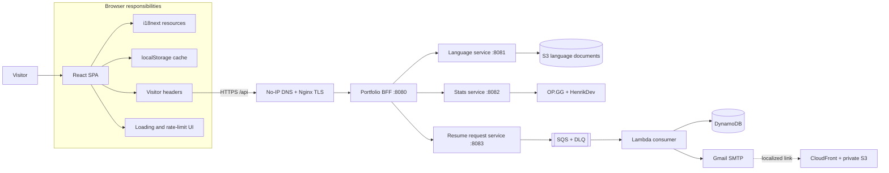

# Portfolio Frontend

**English** | [Español](README.es.md)

<p align="center">
  
  
  
  
  
</p>

Responsive single-page portfolio for **Juan Diego Arévalo Bernal**. It presents professional experience, selected projects, live gaming statistics, the production architecture, and an asynchronous resume-delivery form through a technical editorial interface.

The application is the browser-facing client of the [Portfolio Backend (BFF)](https://github.com/JuanSlaterT/portfolio-backend). Its content is not bundled as static translation files: the frontend discovers the available languages and downloads every translation document from the API during startup.

> Public API: `https://api.juancito.me/api`, configured through `VITE_API_BASE_URL`.

## Highlights

- Responsive technical-editorial interface with four views: Home, Hobbies, Architecture, and Resume.
- Direct links for `/`, `/hobbies`, `/architecture`, and `/resume`, including browser back/forward synchronization.
- API-driven internationalization with automatic browser-language selection and a persistent language switcher.
- Live League of Legends and VALORANT statistics with a five-minute browser cache.
- Interactive architecture documentation for the BFF, microservices, AWS resources, and synchronous/asynchronous request paths.
- Resume request form with validation, localized delivery, optional update subscription, and duplicate-request protection.
- Stable per-browser visitor metadata and a best-effort public IPv4 hash attached to every API request.
- Global loading feedback, API error states, retry actions, and a persistent countdown for HTTP `429` blocks.
- Automated unit and component tests for routing, navigation, visitor identity, caches, and rate-limit persistence.
- Responsive layouts, keyboard focus indicators, semantic landmarks, and reduced mobile navigation.

## Role in the system

This repository owns presentation and browser-side orchestration. It does not call internal services or third-party gaming providers directly. Every operation goes through the public BFF.



A typical browser request follows this path:

1. The app creates or restores the visitor metadata and, when required, attempts to resolve and hash the public IPv4 address through ipify.
2. `src/lib/api.ts` adds the visitor headers and calls the public BFF.
3. Nginx terminates TLS and forwards `/api` traffic to the BFF.
4. The BFF validates the headers, applies its request limiter, and delegates to a private microservice.
5. The frontend reads the shared `{ statusCode, message, data }` response envelope.
6. A `429` response activates the global block screen using the `x-missingTime` response header.

## Pages

| View | Route | Purpose |
| --- | --- | --- |
| **Home** | `/` | Hero, profile summary, technical skill matrix, selected repositories, social links, and contact information. |
| **Hobbies** | `/hobbies` | Live League of Legends and VALORANT statistics plus a grid of personal interests. |
| **Architecture** | `/architecture` | System diagram, request flows, repository catalog, Terraform modules, and operational decisions. |
| **Resume** | `/resume` | Email form that starts the asynchronous localized resume-delivery workflow. |

`App.tsx` uses the browser History API to initialize the active view from the pathname, push navigation entries, and react to `popstate`. Navigation items remain real links, so views can be copied, opened in another tab, refreshed, and traversed with the browser controls without adding a routing dependency.

## Frontend architecture

The root provider order is intentional:

```text
StrictMode
└── RateLimitProvider
    └── LoadingProvider
        └── LanguageProvider
            └── App
                ├── NavBar
                ├── Active page
                └── Footer
```

| Layer | Responsibility |
| --- | --- |
| `RateLimitProvider` | Replaces the application with a global countdown while the visitor is blocked. |
| `LoadingProvider` | Displays a portal-based modal while tracked API operations are running. |
| `LanguageProvider` | Fetches the language catalog and all translation documents before rendering the site. |
| `App` | Synchronizes the current view with the URL and composes the shared navigation and footer. |
| `portfolioApi` | Adds headers, parses the API envelope, translates failed responses into `ApiError`, and detects `429`. |

### Internationalization

Internationalization is runtime and API-driven:

1. The app requests `GET /api/languages`.
2. It downloads each document with `GET /api/languages/{language}` in parallel.
3. Documents are normalized and registered as i18next resource bundles.
4. The initial language is chosen from the saved preference, browser locale, English fallback, or first available language.
5. The selector is generated from the returned catalog and stores the selection under `portfolio-lang`.

If the catalog is empty, contains duplicate codes, or cannot be loaded, the application shows a localized bootstrap error with a retry action. The site intentionally waits for the language service before rendering content.

### Visitor metadata

Every non-preflight API request includes:

| Header | Browser value |
| --- | --- |
| `x-visitorId` | Persistent UUID v4 generated in the browser. |
| `x-ipHash` | Best-effort hash of the public IPv4 returned by ipify: SHA-256 through Web Crypto, with a deterministic fallback when unavailable. If the IPv4 lookup fails, the visitor UUID is hashed instead. |
| `x-userAgent` | Current `navigator.userAgent`. |
| `x-lastSeenAt` | Current Unix timestamp in milliseconds. |

Immediately before every portfolio API request, the client queries `https://api.ipify.org?format=json` with caching disabled, accepts IPv4 only, and stops waiting after 2.5 seconds. The returned address is hashed in memory for that request and is never persisted or sent raw to the portfolio API. Only the stable visitor UUID is stored under `visitor-portfolio`; if `localStorage` is unavailable, the app keeps that identity in memory for the current session.

The resume request reuses the same freshly generated hash in both its `x-ipHash` header and JSON body. This is not a trust boundary: `x-ipHash` remains client-supplied and can be replaced by a modified browser or HTTP client.

### Browser persistence

| Key | Purpose | Lifetime |
| --- | --- | --- |
| `portfolio-lang` | Selected language code. | Until manually cleared. |
| `visitor-portfolio` | Stable visitor UUID only; no IPv4 address or IP hash is stored. | Until manually cleared. |
| `portfolio:my-hobbies:stats:v1` | Last successful gaming-statistics response. | Five minutes. |
| `portfolio:cv-request:v1` | Prevents an immediate duplicate resume request. | Ten minutes. |
| `portfolio:rate-limit-until` | Restores the server-provided block deadline across refreshes and tabs. | Until the deadline expires. |

Stored statistics, resume-request state, and rate-limit deadlines are schema-checked and time-checked before use; malformed or expired entries are discarded. Browser storage remains controlled by the visitor, so these values are convenience controls rather than trusted security state.

## Backend integration

The API base URL is injected by Vite through the required `VITE_API_BASE_URL` environment variable. The default production example is provided in [`.env.example`](.env.example):

```dotenv
VITE_API_BASE_URL=https://api.juancito.me/api
```

[`src/lib/api.ts`](src/lib/api.ts) validates that the value is an absolute HTTP(S) URL and removes any trailing slash before appending endpoint paths.

| Method | Endpoint | Frontend use |
| --- | --- | --- |
| `GET` | `/languages` | Loads the language catalog. |
| `GET` | `/languages/{language}` | Loads one translation document. |
| `GET` | `/stats` | Loads the combined League of Legends and VALORANT view. |
| `POST` | `/resume-request` | Starts asynchronous resume delivery. |

Successful responses must use the BFF envelope:

```json
{
  "statusCode": 200,
  "message": "OK",
  "data": {}
}
```

Resume request body:

```json
{
  "email": "person@example.com",
  "ipHash": "client-generated-hash",
  "language": "en",
  "subscribeToUpdates": true
}
```

Only `en` and `es` are currently sent by the resume form because the downstream consumer owns templates and resume documents for those languages.

## Technology stack

| Area | Technology |
| --- | --- |
| UI | React 18, React DOM |
| Language | TypeScript 5.5 |
| Build tooling | Vite 7.3 |
| Styling | Tailwind CSS 3.4, PostCSS, custom CSS variables |
| Internationalization | i18next, react-i18next |
| Icons | Lucide React |
| Testing and quality | Vitest, Testing Library, jest-dom, jsdom, ESLint 9, TypeScript compiler |
| Browser APIs | Fetch, History, Web Crypto, Local Storage, Intl |

## Design system

The interface combines editorial brutalism with a systems-notebook aesthetic:

- paper surfaces (`#F1EEE5`, `#E5E0D4`, and `#F8F5EC`);
- warm ink (`#171713`) for structure and typography;
- signal orange (`#FF4D00`), acid green (`#D9FF43`), and blueprint blue (`#2457FF`);
- square components, one- or two-pixel borders, hard offset shadows, technical grids, condensed display type, and monospaced metadata;
- short color and transform transitions instead of decorative motion.

Reusable visual primitives such as `.ink-button`, `.outline-button`, `.technical-tag`, `.paper-grid`, and `.display-type` live in `src/index.css`.

## Local development

### Requirements

- Node.js 20.19+ or 22.12+;
- npm;
- network access to the public BFF, or a compatible BFF configured through `VITE_API_BASE_URL`;
- optional access to `api.ipify.org` for public IPv4 hashing. The UUID fallback keeps the site operational if it is unavailable.

`VITE_API_BASE_URL` is required. Copy `.env.example` to the ignored local `.env` file, or define the variable in the build environment. Vite embeds the value at build time, so changing a runtime host variable after deployment does not modify an existing static bundle.

### Install and run

```bash
git clone https://github.com/JuanSlaterT/portfolio-frontend.git
cd portfolio-frontend
npm install
cp .env.example .env
npm run dev
```

Open `http://localhost:5173`.

The production BFF currently allows this origin through CORS. If the frontend runs on another origin, update the backend `CorsConfig` accordingly.

### Available scripts

| Command | Action |
| --- | --- |
| `npm run dev` | Starts the Vite development server. |
| `npm run build` | Creates the production bundle in `dist/`. |
| `npm test` | Runs the automated suite once with Vitest. |
| `npm run test:watch` | Runs Vitest in watch mode. |
| `npm run typecheck` | Runs TypeScript without emitting files. |
| `npm run lint` | Runs ESLint across the project. |
| `npm run preview` | Serves the built bundle locally. |

### Automated tests

The test suite runs in jsdom and covers:

- route/path mapping, direct links, History API navigation, and unknown-path canonicalization;
- real navigation `href` values and client-side click handling;
- IPv4 validation, hashing, legacy visitor upgrades, and offline fallback;
- statistics-cache schema validation, tampering rejection, and TTL expiration;
- rate-limit persistence and expiration.

## Production build

```bash
npm ci
npm run typecheck
npm test
npm run build
npm run preview
```

Ensure `VITE_API_BASE_URL` is defined before `npm run build`; the production example targets `https://api.juancito.me/api`.

`dist/` is a static SPA bundle and can be deployed to an object store/CDN such as Amazon S3 and CloudFront. The frontend hosting workflow is separate from the BFF and microservice deployments.

The production host must serve `index.html` for `/hobbies`, `/architecture`, `/resume`, and unknown application paths. On S3/CloudFront, configure the SPA fallback through the distribution/error-response or rewrite layer; otherwise a direct request to a nested route can return an object-store `404` before React starts.

## Repository structure

```text
.
├── public/
│   └── favicon.svg
├── src/
│   ├── components/
│   │   ├── layout/              # Page and section headings
│   │   ├── LanguageProvider.tsx # Runtime translation bootstrap
│   │   ├── LanguageSwitcher.tsx
│   │   ├── LoadingProvider.tsx
│   │   ├── LoadingModal.tsx
│   │   ├── NavBar.tsx
│   │   └── RateLimitProvider.tsx
│   ├── contexts/                # Loading and language contexts
│   ├── hooks/                   # Context-facing hooks
│   ├── i18n/                    # i18next initialization and preference storage
│   ├── lib/
│   │   ├── api.ts               # BFF contract and request client
│   │   ├── rateLimit.ts
│   │   ├── routes.ts            # URL/page mapping
│   │   ├── statsCache.ts        # Validated five-minute stats cache
│   │   └── visitor.ts
│   ├── pages/                   # Home, Hobbies, Architecture, and Resume
│   ├── test/                    # Shared Vitest/Testing Library setup
│   ├── App.tsx
│   ├── index.css
│   └── main.tsx
├── .env.example
├── index.html
├── package.json
├── tailwind.config.js
├── tsconfig*.json
└── vite.config.ts
```

## Related repositories

| Repository | Responsibility |
| --- | --- |
| [`portfolio-backend`](https://github.com/JuanSlaterT/portfolio-backend) | Public Java BFF, visitor validation, response envelope, CORS, and rate limiting. |
| [`portfolio-microservices-language_service`](https://github.com/JuanSlaterT/portfolio-microservices-language_service) | Translation catalog and documents stored in S3. |
| [`portfolio-microservices-stats_service`](https://github.com/JuanSlaterT/portfolio-microservices-stats_service) | Aggregated OP.GG and HenrikDev gaming statistics. |
| [`portfolio-microservices-resume_request_service`](https://github.com/JuanSlaterT/portfolio-microservices-resume_request_service) | Validates resume requests and publishes them to SQS. |
| [`portfolio-consumer-resume_request`](https://github.com/JuanSlaterT/portfolio-consumer-resume_request) | Lambda consumer for persistence, notifications, localized email delivery, and SQS partial-batch failure reporting. |
| [`portfolio-arch-terraform`](https://github.com/JuanSlaterT/portfolio-arch-terraform) | AWS infrastructure, networking, runtime stack, observability, and deployments. |

## Current considerations

- The language API is a startup dependency; without it, the main application does not render.
- The public API URL is hard-coded rather than selected through a Vite environment variable.
- Direct links require the static host/CDN to rewrite application paths to `index.html`.
- Visitor metadata and rate limiting are abuse controls, not authentication or authorization.
- Public IPv4 lookup is best-effort and introduces a request to ipify. Its hash remains client-supplied, can represent a shared NAT address, and must not be used as verified identity; the UUID hash is used when lookup fails.
- Statistics availability depends on both external providers used by the stats service.
- Resume acceptance confirms queue submission. The Lambda reports partial batch failures so SQS retries only failed records; after the configured redrive attempts, unresolved messages remain in the DLQ for investigation, replay, or manual email delivery.
- Browser storage remains editable by the visitor. The application validates structure and expiration and safely rejects malformed values, but neither `Object.freeze()` nor frontend code can provide tamper-proof client storage.
- The automated suite covers unit and jsdom component behavior; full browser end-to-end and visual regression tests are not yet configured.

## Author

**Juan Diego Arévalo Bernal**  
[GitHub](https://github.com/JuanSlaterT) · [LinkedIn](https://www.linkedin.com/in/juan-diego-ar%C3%A9valo-bernal-219428227/)
